# Grodków Water Tower — UAV Photogrammetry & 3D Reconstruction

A UAV photogrammetry and 3D reconstruction case study focused on **image QA, capture geometry, reconstruction quality, model comparison and final presentation**.

The project uses two separate DJI Mini 4K acquisitions of the same water tower:

- **Model A — Sunny** — strong directional sunlight, high redundancy and pronounced shadows.
- **Model B — Overcast** — more diffuse lighting, revised capture geometry and fewer images.
- **Model C — Combined Curated** — all approved Overcast images plus a spatially selected subset of Sunny images.

The aim was not simply to produce a visually attractive model. I wanted to understand **how lighting, capture geometry, image selection and redundancy affect the final 3D reconstruction**.

> **Important:** This is a photogrammetry and QA portfolio project, not a survey-grade measurement project. No RTK, GCP network or independently surveyed checkpoints were used.

---

## Final Result

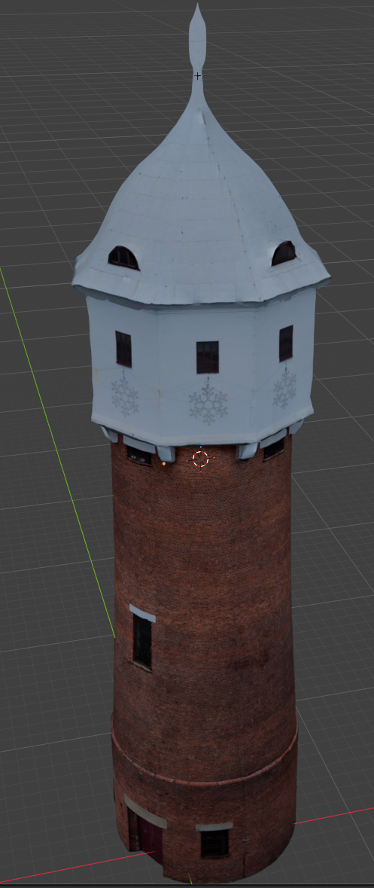

[▶ Watch the final animations](#15-final-presentation-and-animations)

The final presentation model is based on **Model B — Overcast**, which provided the best overall balance of reconstruction completeness, consistent texture and processing efficiency.

Model A and Model C were retained as comparison assets rather than discarded.

<p align="center">
  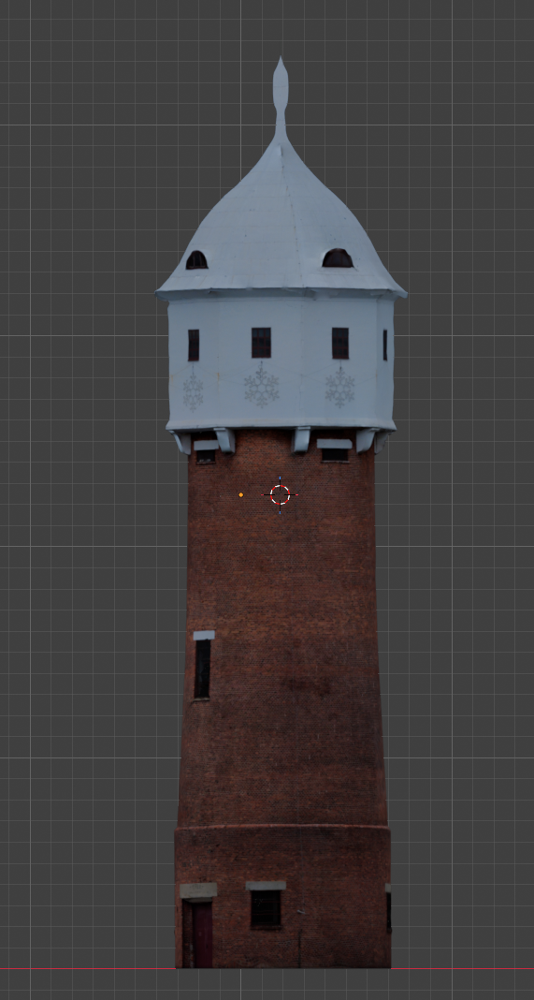
</p>

---

## Project at a Glance

| Item | Result |
|---|---|
| UAV platform | DJI Mini 4K |
| Acquisition 01 | Sunny — 24 Aug 2026 |
| Acquisition 02 | Overcast — 25 Aug 2026 |
| Model A input | 442 QA-approved images |
| Model B input | 283 QA-approved images |
| Model C input | 403 images: 283 Overcast + 120 curated Sunny |
| Model A dense cloud | 33.69 million points |
| Model B dense cloud | 28.77 million points |
| Model C dense cloud | 38.83 million points |
| Final technical baseline | Model B — Overcast |
| Main software | WebODM, QGIS, CloudCompare, Blender, Python, ExifTool |
| Final presentation | Cleaned textured model + two vertical animations |
| Mission documentation | Acquisition 01 as-flown record + Acquisition 02 revised mission plan |

---

## Workflow

```text
UAV Capture
   ↓
EXIF / Metadata Audit
   ↓
Automated Image QA
   ↓
Manual KEEP / REJECT Review
   ↓
Capture Geometry QA
   ↓
WebODM 3D Reconstruction
   ↓
CloudCompare QA
   ↓
A / B / C Comparison
   ↓
Final Model Selection
   ↓
Blender Cleanup & Presentation
   ↓
Final Animations / Portfolio Output
```


---

# 1. UAV Acquisition

Two separate acquisitions were completed on consecutive days.

### Acquisition 01 — Sunny

- 446 original JPG images
- strong direct sunlight
- pronounced shadow differences around the tower
- high redundancy and dense multi-view coverage
- 442 images retained after QA

### Acquisition 02 — Overcast

- 285 original JPG images
- diffuse overcast lighting
- revised orbit and roof-coverage strategy
- one partial low orbit due to nearby obstacles
- 283 images retained after QA

The two datasets were intentionally processed as **independent 3D reconstructions** before testing any combined dataset.
The acquisition work in this case study is used mainly to understand and document how upstream capture decisions affect downstream processing quality.

---

# 2. Capture Context and Mission Documentation

This case study included two field acquisitions so I could directly study how **capture geometry, lighting and image redundancy** affected the later 3D reconstruction.

My longer-term focus is on **processing, QA and analysis of UAV datasets supplied by pilots, surveyors and other clients**, rather than offering drone-flight services. The mission documentation is therefore included as upstream context: it helps explain why certain reconstruction strengths and weaknesses appeared later in WebODM and CloudCompare.

The first mission card records both the original plan and the **actual as-flown acquisition**, including field changes, obstacles, battery limitations and metadata observations.

The second mission card is a **revised mission plan** created after lessons from the first acquisition. It reduced unnecessary redundancy, added lower-level coverage, strengthened nadir / gimbal checks and introduced a clearer battery-reserve strategy.

> The retained Acquisition 02 document is a revised planning / pre-flight record, not a complete final as-flown log.

### Mission documents

- [Acquisition 01 — Mission Card / As-Flown Record](docs/mission_planning/Grodkow_Water_Tower_Mission_Card_v1_FINAL.pdf)
- [Acquisition 02 — Revised Mission Plan](docs/mission_planning/Grodkow_Water_Tower_Mission_Card_v2_Revised_Plan.pdf)

---

# 3. Image QA

Automated QA was used as **decision support**, not as an automatic deletion system.

The workflow separated:

```text
Automated status: PASS / REVIEW
Manual decision: KEEP / REJECT
Final status: INCLUDED / EXCLUDED
```

This made it possible to preserve the reason why an image was flagged while keeping the final inclusion decision under manual control.

### Example QA evidence

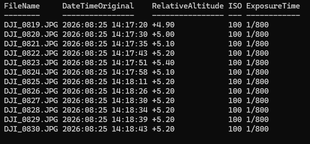

For the Overcast dataset:

- 285 original images
- 250 automatic PASS
- 35 manual-review images
- 33 manually kept
- 2 rejected
- **283 final images ready for 3D reconstruction**

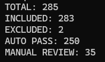

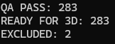

The same decision-support principle was used for the Sunny acquisition.

---

# 4. Capture Geometry QA

Image quality alone was not enough. Camera positions and height distribution were also reviewed before reconstruction.

The checks included:

- orbit and altitude coverage
- missing or partial sectors
- continuity between height levels
- base, shaft, upper structure and roof coverage
- obstacle-driven gaps
- redundant or replacement imagery

### Sunny camera distribution

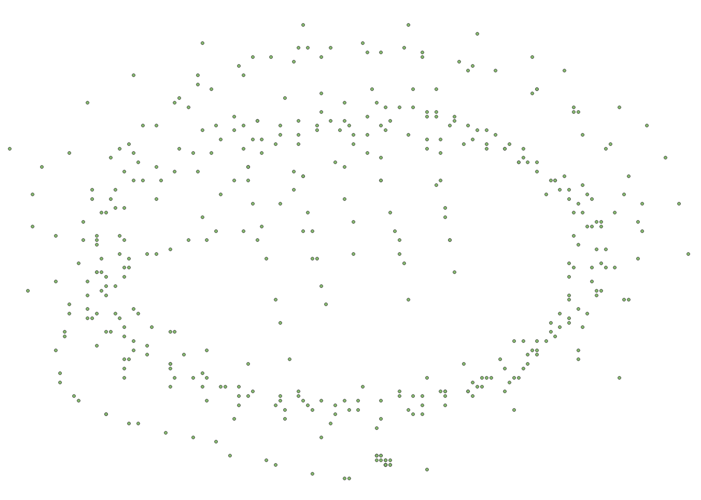

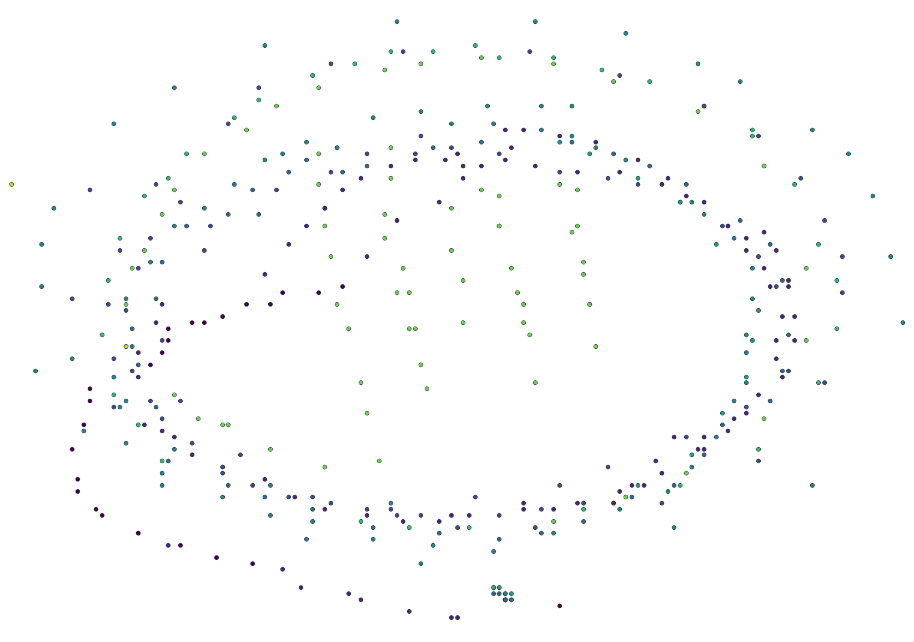

This step helped identify whether a weakness in the final model was more likely related to the source imagery, capture geometry or later processing.

---

# 5. Model A — Sunny

Model A was reconstructed independently from **442 QA-approved Sunny images**.

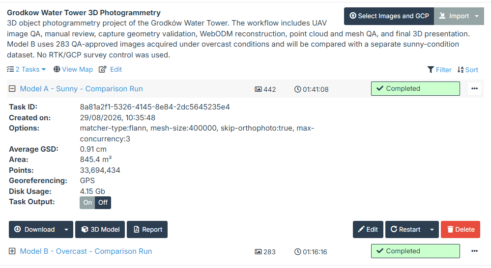

The reconstruction produced:

- **33,694,434 dense points**
- average GSD: **0.91 cm**
- processing time: **1:41:08**
- strong brick detail in well-lit areas
- higher point-cloud density than Model B
- weaker consistency in some white upper surfaces and roof areas
- strong illumination differences between sunlit and shadowed sectors

After isolation in CloudCompare:

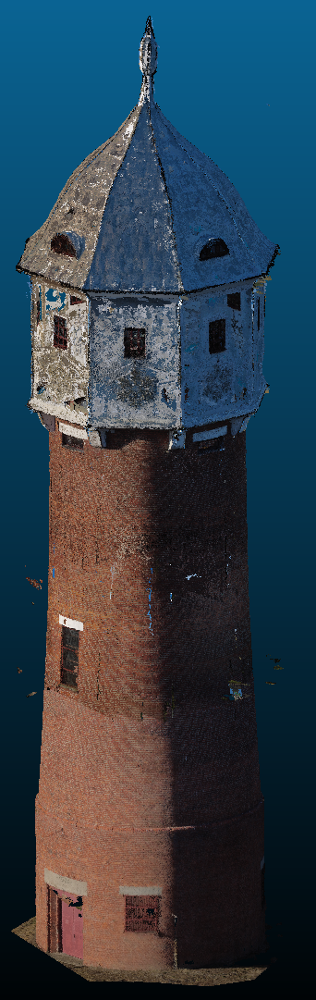

The isolated tower cloud contained approximately **28.93 million points**.

Model A was **not selected as the final presentation baseline**, but it remained useful as a complementary reconstruction with strong local detail and additional viewpoints.

---

# 6. Model B — Overcast

Model B was reconstructed independently from **283 QA-approved Overcast images**.

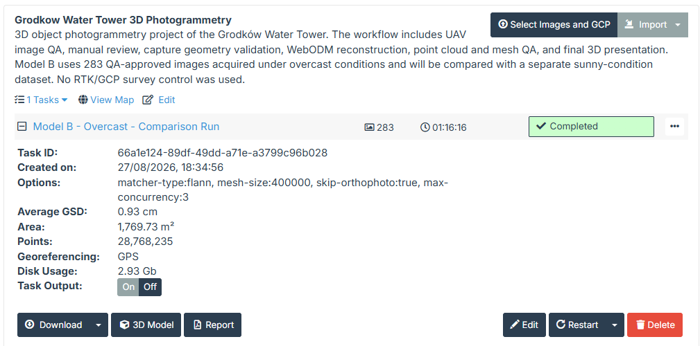

The reconstruction produced:

- **28,768,235 dense points**
- 281 / 283 images registered by SfM
- average GSD: **0.93 cm**
- processing time: **1:16:16**
- more even texture around the whole tower
- better continuity in the white upper structure and roof
- fewer large reconstruction gaps in the upper section

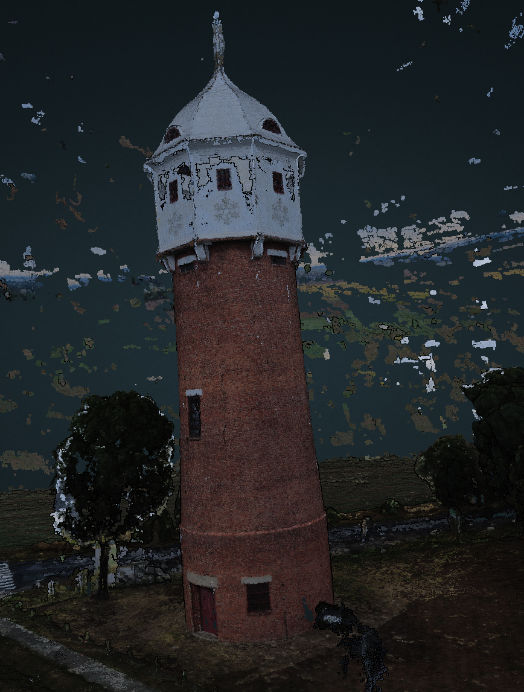

### Roof reconstruction

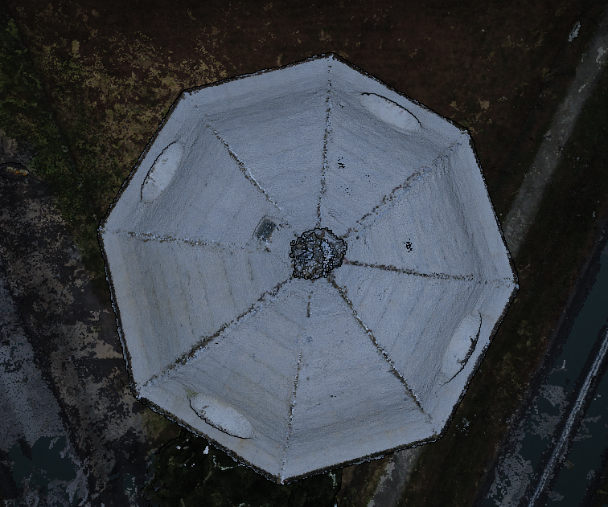

### Isolated tower cloud

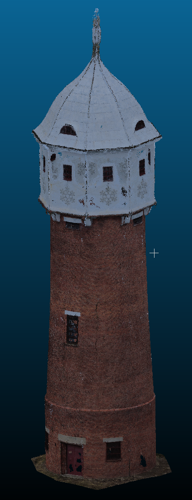

The isolated Model B tower cloud contained approximately **17.99 million points**.

Model B became the **preferred technical baseline** for final cleanup and presentation.

---

# 7. Why Global SOR Filtering Was Rejected

Global Statistical Outlier Removal was tested on working copies of both reconstructions.

For Model B, two configurations were tested. Both removed some obvious noise, but they also removed valid points from already sparse architectural surfaces.

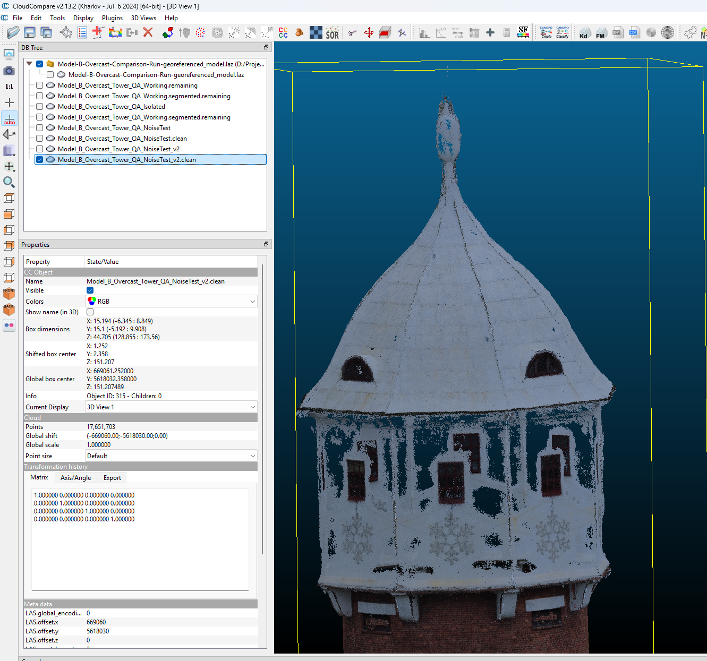

The final decision was therefore to keep the **isolated but globally unfiltered point cloud** as the QA reference.

This was an important project decision: improving visual cleanliness was not worth losing valid reconstruction geometry.

---

# 8. Model A vs Model B

The two independently reconstructed point clouds did not align well enough using raw onboard GPS alone.

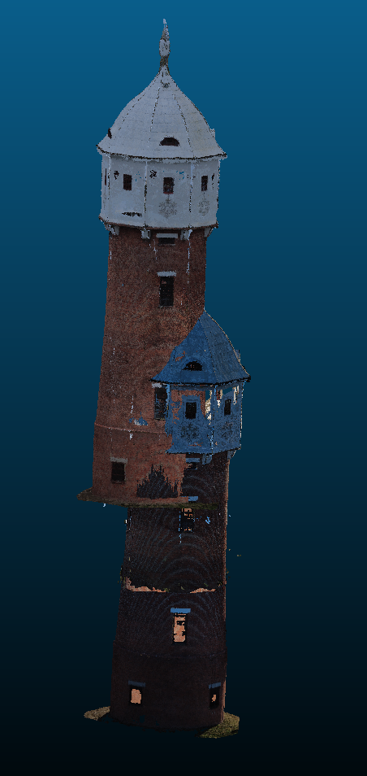

The clouds were therefore aligned in CloudCompare using:

1. manual point-pair registration
2. ICP fine registration
3. fixed scale of 1.0

Final ICP RMS:

**0.0972 m**

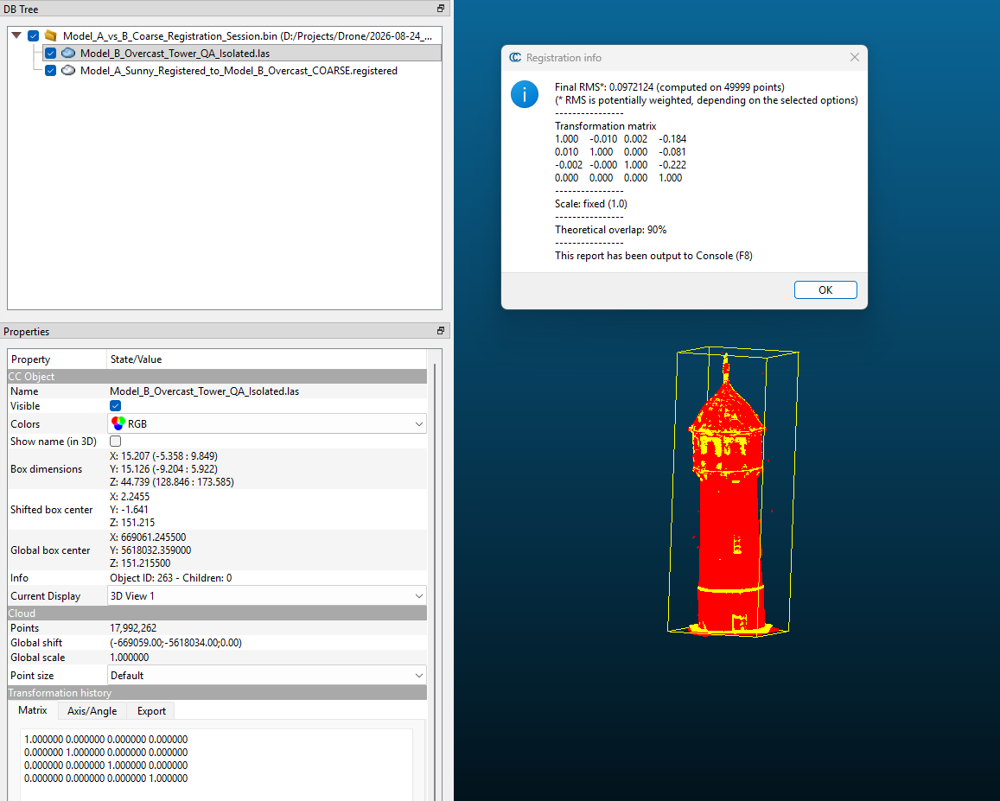

This value describes the **relative registration between the two reconstructions**. It is not an absolute accuracy measurement.

---

## Lighting and Completeness Comparison

One of the clearest differences was visible on the shadow side.

| Model A — Sunny | Model B — Overcast |
|---|---|
| 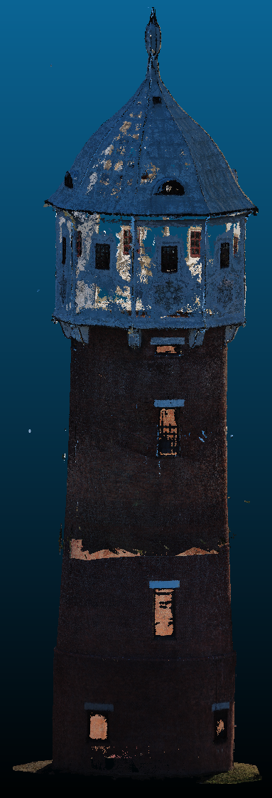 | 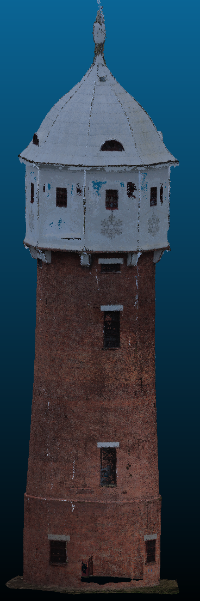 |

The Sunny model preserved strong local texture contrast where lighting was favourable, but the Overcast model gave a more even whole-object appearance.

The upper structure showed an even clearer difference:

| Model A — Sunny | Model B — Overcast |
|---|---|
| 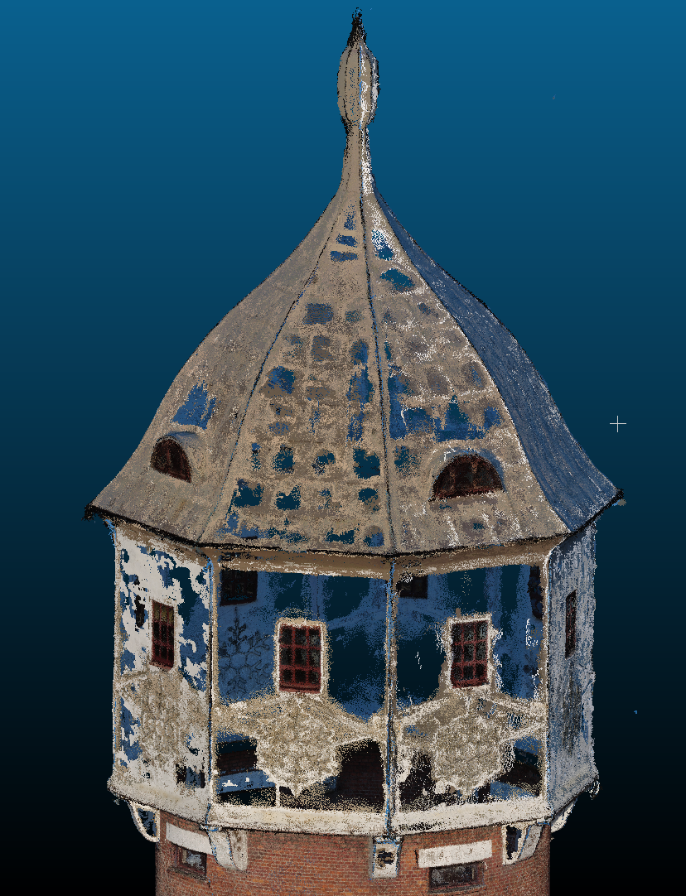 | 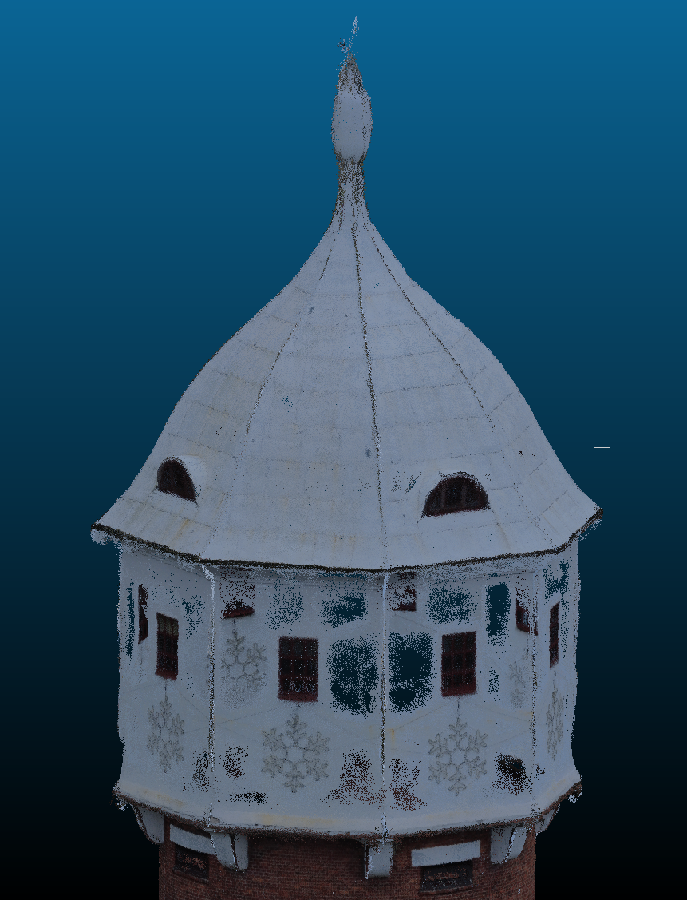 |

Model B showed more continuous reconstruction around the white head and roof.

The correct conclusion is **not simply that cloudy weather is always better**. The two acquisitions also differed in image count, orbit structure, redundancy and viewpoint distribution.

The final result reflects the combined effect of:

**lighting + capture geometry + image selection + redundancy**

---

# 9. Relative Cloud-to-Cloud Comparison

After ICP registration, a bidirectional Cloud-to-Cloud comparison was used to see where the two reconstructions agreed and where larger local differences remained.

### Sunny → Overcast

- mean distance: **0.0505 m**
- standard deviation: **0.0676 m**

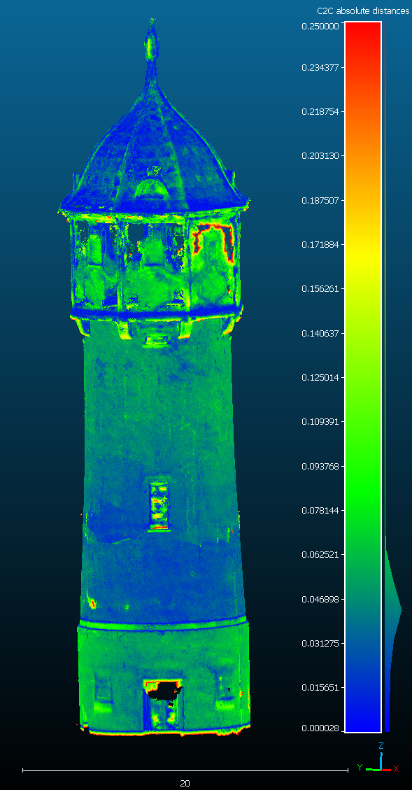

### Overcast → Sunny

- mean distance: **0.0634 m**
- standard deviation: **0.0923 m**

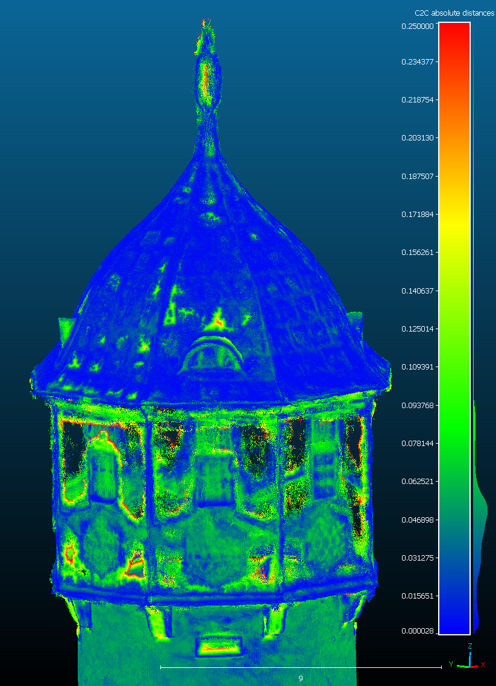

Larger differences were concentrated around:

- windows and openings
- white upper surfaces
- roof and eave edges
- the thin spire
- local reconstruction gaps

The main brick shaft was much more consistent between the two models.

These values describe **relative model-to-model differences after registration**. They should not be interpreted as survey accuracy.

---

# 10. Model C — Combined Curated

Model C tested whether combining both acquisition days could improve the final reconstruction.

Instead of merging every available image, the dataset was curated.

It contained:

- all **283 Overcast images**
- **120 selected Sunny images**
- **403 images total**

The Sunny subset was selected using altitude / azimuth coverage and spatial QA.

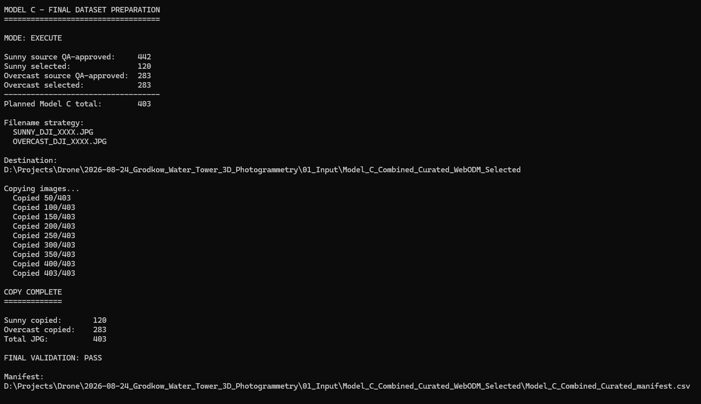

### Processing adjustment

The larger combined dataset required a more conservative WebODM processing setup.

Processing concurrency was reduced while the quality-related reconstruction settings were kept unchanged.

The reconstruction then completed successfully.

Model C produced:

- **38,832,056 dense points**
- 397 / 403 reconstructed images
- average GSD: **0.91 cm**
- processing time: **3:45:54**

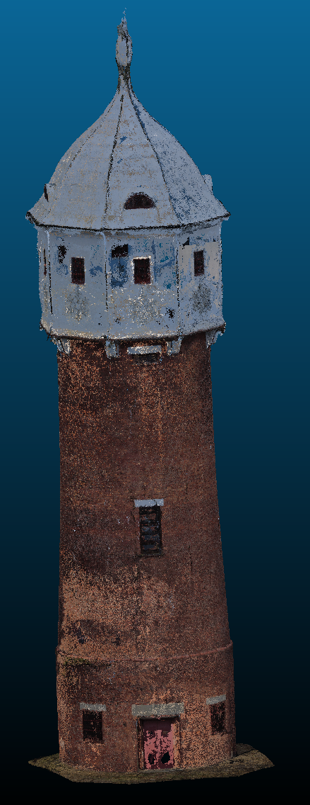

Model C produced:

- **38,832,056 dense points**
- 397 / 403 reconstructed images
- average GSD: **0.91 cm**
- processing time: **3:45:54**


Model C produced:

- **38,832,056 dense points**
- 397 / 403 reconstructed images
- average GSD: **0.91 cm**
- processing time: **3:45:54**


---

# 11. Model B vs Model C

Model C was denser than Model B and showed strong relative geometric agreement after registration.

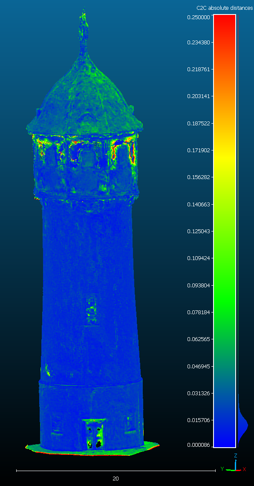

However, the additional images did **not** produce a clear enough improvement in final texture quality or geometry to justify the much higher processing cost.

This became one of the most useful findings of the project:

> **More images did not automatically produce a better final model.**

For this tower, the smaller and illumination-consistent Overcast dataset provided the better overall baseline.

---

# 12. Texture Comparison — A / B / C

The final decision was not made from point-cloud density alone. Texture quality was also reviewed separately.

<table>
<tr>
<th>Model A — Sunny</th>
<th>Model B — Overcast</th>
<th>Model C — Combined Curated</th>
</tr>
<tr>
<td>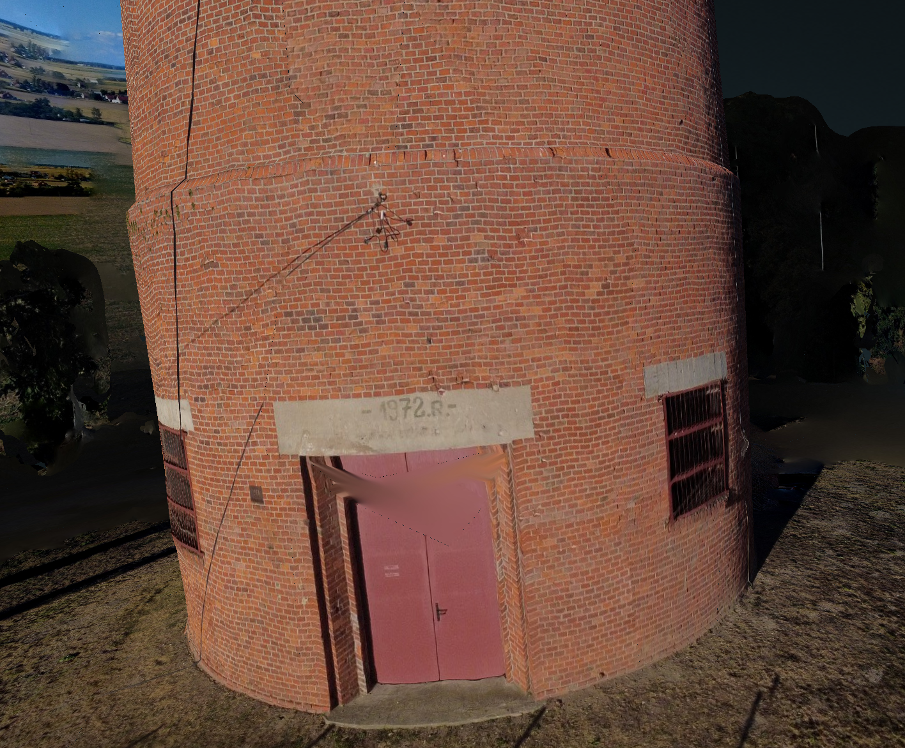</td>
<td>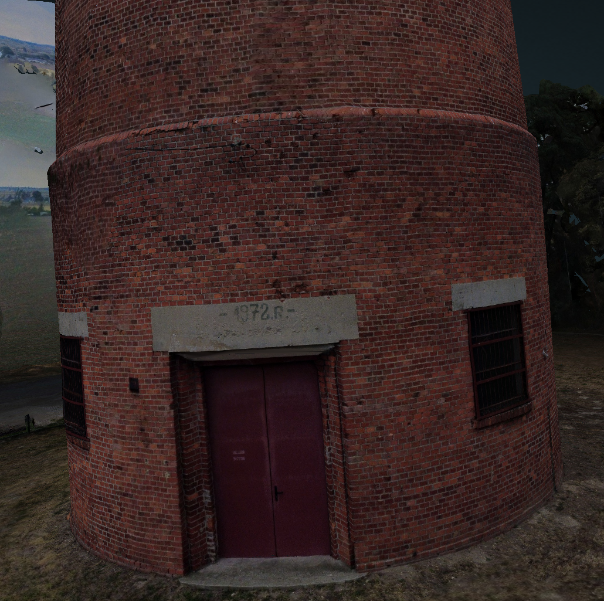</td>
<td>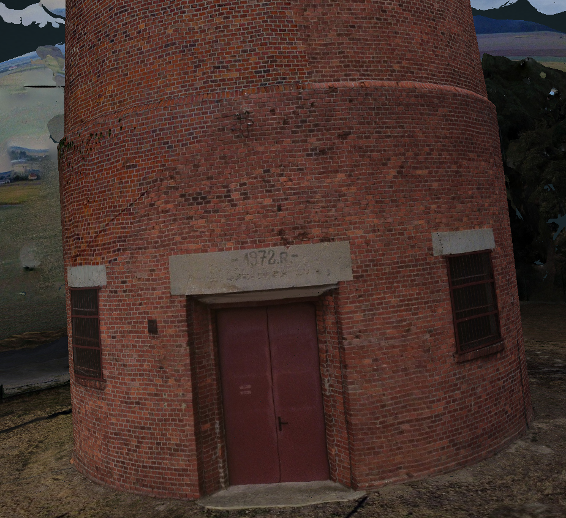</td>
</tr>
</table>

The Sunny model could provide strong local brick detail, but this example also shows the effect of the less consistent acquisition conditions around the entrance.

Model B gave the strongest overall balance of:

- readable detail
- consistent illumination
- good object coverage
- stable upper-structure reconstruction
- lower processing cost

Model C was technically successful, but it did not provide a decisive final-quality advantage over Model B.

---

# 13. Final Model Selection

### Selected baseline: **Model B — Overcast**

Model B was selected for Blender cleanup because it provided the best overall balance of:

- reconstruction completeness
- texture consistency
- roof and upper-structure quality
- single-session consistency
- processing efficiency

Model A remained a useful comparison and complementary dataset.

Model C showed that images from both days could be combined successfully, but the extra images increased processing time without clearly improving the final result.

---

# 14. Blender Cleanup and Presentation

The selected Model B textured reconstruction was imported into Blender for presentation-stage cleanup.

### Initial import

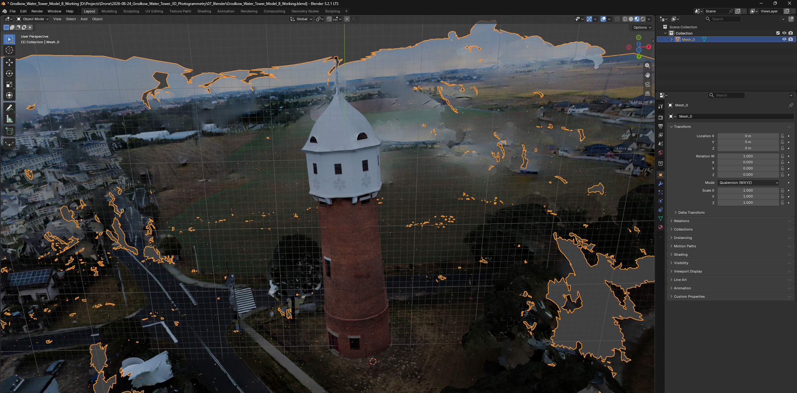

The aim was **not to redesign the tower**. Cleanup was kept local where possible.

The work included:

- isolating the tower from remaining surroundings
- reviewing orientation and scale
- checking visible mesh defects
- local repair of selected surface problems
- refinement of the roof finial / ornament
- correction of a small number of visible presentation defects
- final camera and animation setup

### Example — finial reconstruction

The thin roof finial was one of the least stable photogrammetric elements.

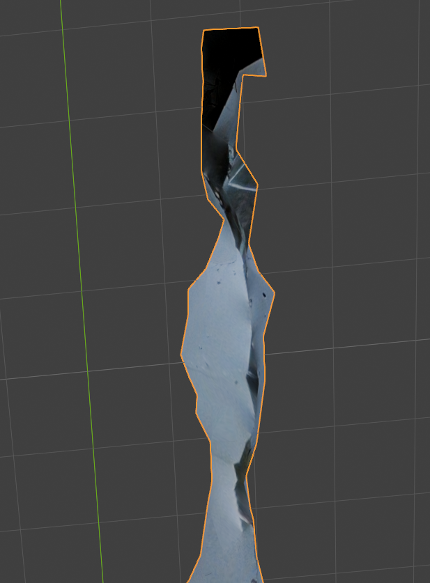

A controlled local reconstruction was prepared rather than rebuilding the full roof.

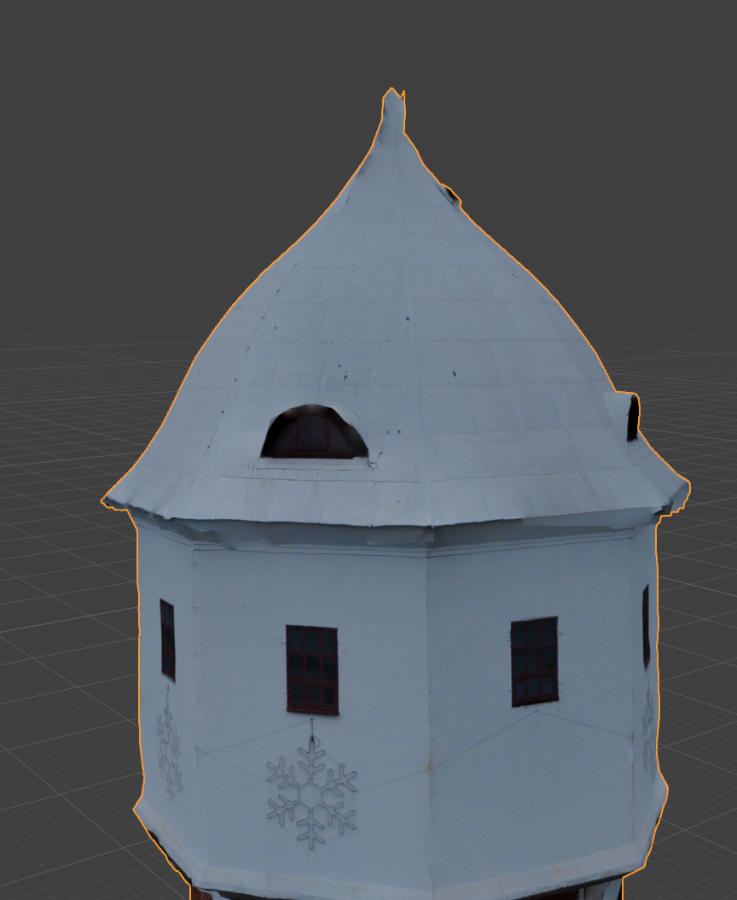

Final result:

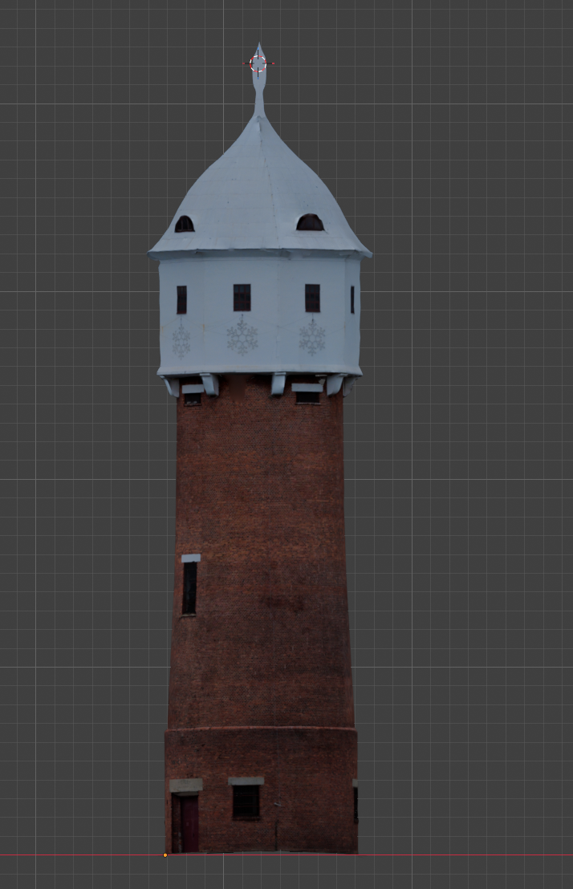

---

## Manual + AI-Assisted Blender Workflow

The presentation stage used a **hybrid manual and AI-assisted workflow**.

Manual work included inspection, decision-making, comparison with the photogrammetric source and acceptance or rejection of each change.

AI-assisted Blender automation was used for selected local refinement and animation tasks.

The original photogrammetric assets were preserved, and experiments were performed on working copies.

AI assistance was therefore used as a production tool rather than as a replacement for the photogrammetric reconstruction or QA process.

---

# 15. Final Presentation and Animations

The project was completed with two vertical presentation videos.

### Hero Animation — FINAL

https://github.com/user-attachments/assets/e17b433c-944d-4354-90fc-fd2c74a309f4

- 1080 × 1920
- 60 fps
- 15 seconds
- high-angle camera
- smooth 360° rotation
- technical GIS-style background
- grounded presentation base
- final project branding

### Reconstruction Process Animation — FINAL

https://github.com/user-attachments/assets/ac529bfd-5558-4975-b354-5683b83c29d4

The process animation shows the model progressing through:

```text
Raw Point Cloud
→ Isolated Tower Point Cloud
→ Coarse Cleanup Mesh
→ Improved / Aligned Model
→ Final Textured Model
```

The final version is 15 seconds long and ends with:

**Igor Hajducki**  
**DroneCube Analytics**

### Blender animation setup

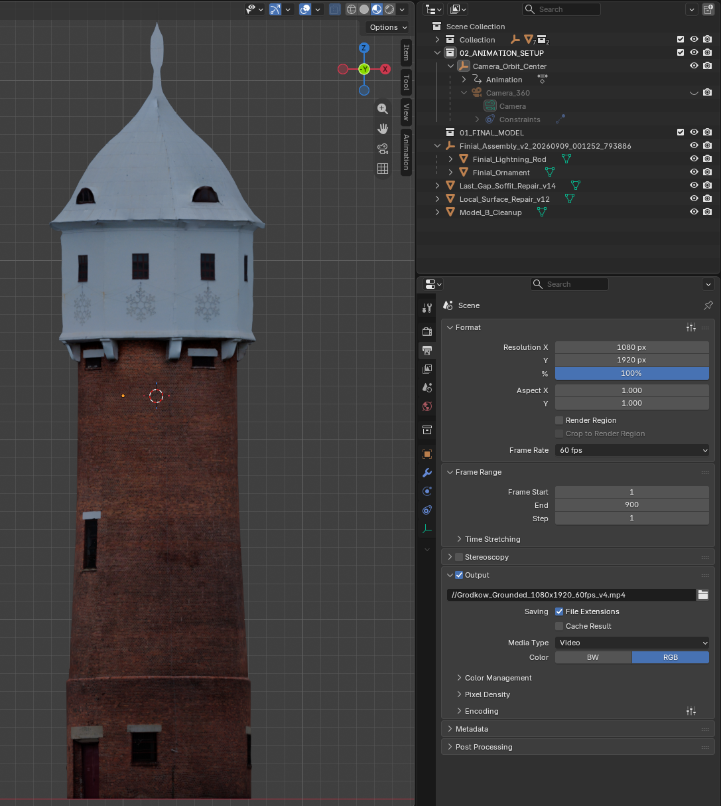

---

# 16. Key Lessons Learned

### 1. Lighting matters, but it is not the only factor

Diffuse lighting helped Model B achieve a more even appearance, especially around the white upper structure.

However, reconstruction quality also depended on orbit geometry, image selection, redundancy and viewpoint distribution.

### 2. More images are not automatically better

Model C produced the densest point cloud, but it also required much more processing time and memory.

The additional 120 Sunny images did not create a proportional improvement in the final model.

### 3. Cleanup should not hide QA problems

Aggressive global point filtering was rejected because it removed valid architectural geometry.

The project keeps reconstruction defects documented rather than silently cleaning them away.

### 4. Capture geometry should be checked before processing

Camera-position and altitude QA helped explain weak sectors and provided a better basis for interpreting reconstruction defects.

### 5. Thin and low-texture geometry remains difficult

The finial, white upper surfaces, opening edges and some roof details remained the most difficult areas to reconstruct consistently.

---


# 17. Tools

| Area | Tools |
|---|---|
| UAV capture | DJI Mini 4K |
| Metadata | ExifTool |
| Image QA / data checks | Python |
| Spatial / capture QA | QGIS |
| Photogrammetry | WebODM / OpenDroneMap |
| Point-cloud QA | CloudCompare |
| Final model / animation | Blender |
| Presentation-stage assistance | Blender + Codex / Astra-assisted workflow |

---

# 18. Limitations

This project does not claim survey-grade accuracy.

The main limitations are:

- no RTK positioning
- no GCP network
- no independently surveyed checkpoints
- onboard GPS only
- different acquisition geometry between the two days
- different lighting conditions
- nearby trees, cables and other obstacles
- unreliable gimbal-angle metadata for this workflow
- thin and low-texture architectural features remain difficult to reconstruct

Therefore:

- ICP RMS is treated as a registration-quality metric
- C2C values describe relative surface differences
- WebODM GPS statistics are not independent accuracy measurements
- reconstruction-derived dimensions should not be presented as certified measurements

---

# 19. Project Outcome

The project produced three complete reconstruction strategies:

**Model A — Sunny**  
Detailed and dense, but affected by strong illumination differences and weaker upper-structure completeness.

**Model B — Overcast**  
The best overall balance of completeness, texture consistency and processing efficiency. Selected as the final technical baseline.

**Model C — Combined Curated**  
The densest reconstruction, but it took much longer to process and did not clearly improve the final result.

The final workflow became:

```text
capture
→ QA
→ geometry review
→ independent reconstruction
→ point-cloud QA
→ model comparison
→ evidence-based model selection
→ local cleanup
→ final presentation
```

That process — rather than the final render alone — is the main result of the case study.

---

## Author

**Igor Hajducki**  
GIS / UAV Data Processing / Photogrammetry / 3D Reconstruction

GitHub: [IgorH-GIS](https://github.com/IgorH-GIS)  
LinkedIn: [Igor Hajducki](https://www.linkedin.com/in/igor-hajducki/)

**DroneCube Analytics** — developing UAV photogrammetry, GIS and 3D data-processing workflows.
